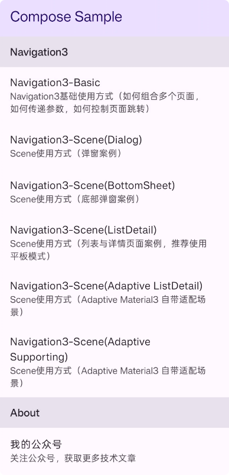

# Compose Sample Project

这是一个基于 Jetpack Compose 的 Android 示例源码项目，。



## 🎯 项目特色

- **现代化架构**：采用最新的 Jetpack Compose 和 Navigation3
- **Material Design 3**：遵循最新的设计规范
- **响应式布局**：支持多种屏幕尺寸和设备类型
- **实用示例**：包含丰富的实际应用场景

## 📁 项目结构

```
app/src/main/java/cn/mengfly/compose_sample/
├── MainActivity.kt              # 主入口Activity
├── common/                      # 通用组件
│   └── pages/                  # 通用页面组件
├── sample/                     # 示例代码
│   ├── aboutme/                # 关于作者相关示例
│   └── navigation3/            # Navigation3 相关示例
```

## 🚀 功能特性

### 🔧 核心技术栈
- **Jetpack Compose**：现代化声明式UI框架
- **Navigation3**：新一代导航系统
- **Material Design 3**：最新的Material设计语言
- **Kotlin Serialization**：数据序列化支持
- **Adaptive Layout**：自适应布局组件

## ▶️ 运行项目

### 环境要求
- Android Studio Ladybug (2024.2.1) 或更高版本
- JDK 11 或更高版本
- Android SDK 36
- 最低支持 Android 7.0 (API 24)

### 运行步骤
1. 克隆项目到本地
2. 使用 Android Studio 打开项目
3. 等待 Gradle 同步完成
4. 选择目标设备（模拟器或真机）
5. 点击运行按钮或使用快捷键 `Shift + F10`

## 📚 学习资源

- [Navigation3官方案例](https://github.com/android/nav3-recipes)
- [Jetpack Compose 官方文档](https://developer.android.google.cn/jetpack/compose)
- [Navigation3 官方指南](https://developer.android.google.cn/guide/navigation)
- [Material Design 3 指南](https://m3.material.io/)
- [Compose 路线图](https://developer.android.google.cn/jetpack/androidx/releases/compose)
- [Android 开发者官网](https://developer.android.google.cn/)

## 🤝 贡献

欢迎提交 Issue 和 Pull Request 来改进这个示例项目！

如果你觉得这个项目有帮助，请给个 ⭐ Star 支持一下！

## 📞 联系方式

关注我的微信公众号获取更多技术分享和更新信息。


